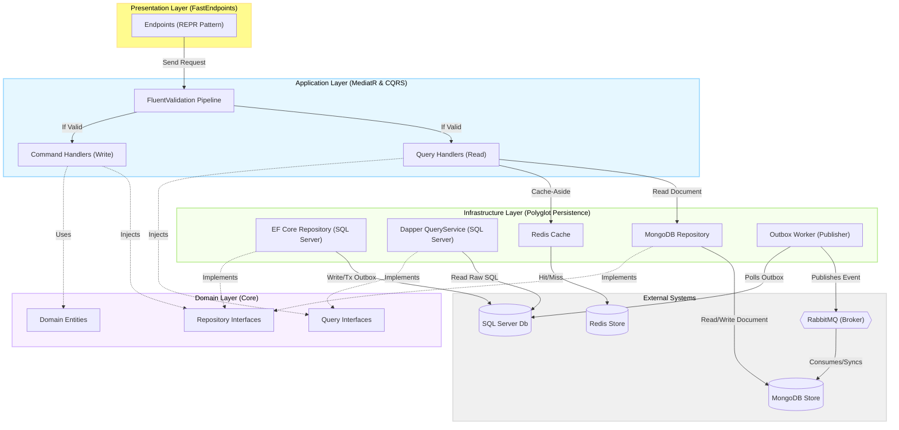
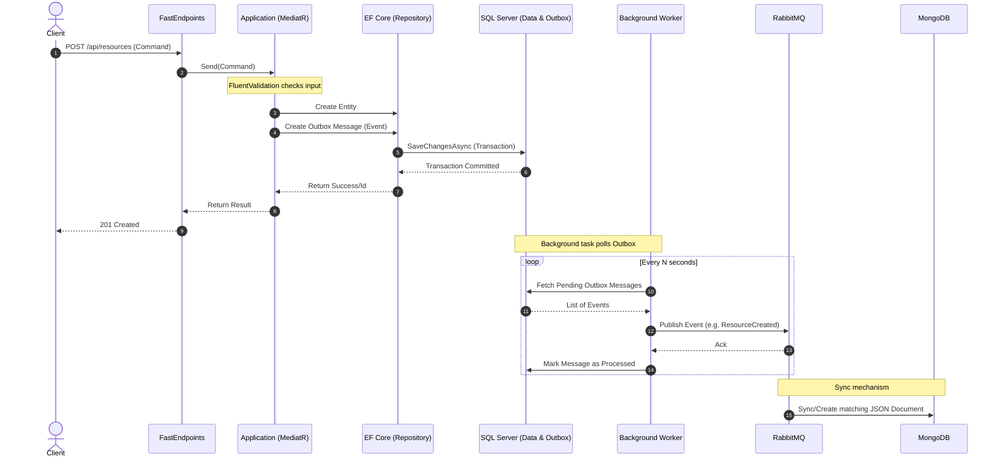
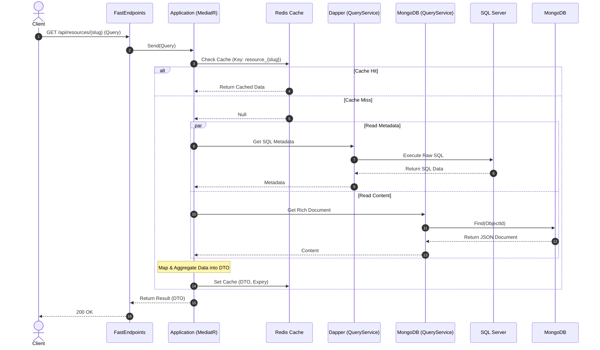

# Kiến trúc Hệ thống .NET Core Backend (Clean Architecture & CQRS)
Hệ thống của bạn được thiết kế tuân thủ nghiêm ngặt **Clean Architecture** (Kiến trúc sạch) kết hợp cùng **CQRS** (Command Query Responsibility Segregation). Sự kết hợp này mang lại khả năng mở rộng cao, dễ dàng bảo trì và tối ưu hóa hiệu năng riêng biệt cho cả luồng Đọc (Query) và Ghi (Write).

## 1. Nguyên lý Độc lập (The Dependency Rule)

Nguyên tắc cốt lõi của Clean Architecture là **Dependency Rule**: Các lớp bên trong (Inner Layers) tuyệt đối không được phụ thuộc vào các lớp bên ngoài (Outer Layers).

- Mũi tên phụ thuộc luôn hướng vào trung tâm (Domain Layer).
- Interfaces được định nghĩa ở lớp bên trong (ví dụ: `IRepository`) nhưng được triển khai (implement) ở lớp bên ngoài (Infrastructure). Cơ chế này gọi là **Dependency Inversion**.

## 2. Trách nhiệm của các Lớp (Layers)

### 2.1. Domain Layer (Lõi hệ thống)

Đây là trái tim của hệ thống, không phụ thuộc vào bất kỳ framework hay công nghệ ngoại vi nào.

- **Entities**: Chứa các đối tượng nghiệp vụ cốt lõi (ví dụ: `Location`, `Contribution`).
- **Interfaces**: Định nghĩa các hợp đồng (contracts) cho Repository (`IRepository`, `IUnitOfWork`) mà Infrastructure sẽ phải thực thi.
- **Domain Exceptions & Rules**: Các logic và quy tắc kinh doanh thuần túy.

### 2.2. Application Layer (Nghiệp vụ ứng dụng)

Điều phối các use-cases của ứng dụng. Lớp này chỉ phụ thuộc vào Domain Layer.

- **CQRS với MediatR**: Tách biệt luồng Ghi (`Commands`) và luồng Đọc (`Queries`).
- **FluentValidation**: Hoạt động như một Pipeline Behavior trong MediatR để kiểm tra tính hợp lệ của Request trước khi tiến tới Handler.
- **DTOs**: Chứa các Data Transfer Objects dùng để định dạng dữ liệu trả về.

### 2.3. Infrastructure Layer (Cơ sở hạ tầng)

Chịu trách nhiệm giao tiếp với thế giới bên ngoài (Database, Message Broker, Cache). Phụ thuộc vào Application và Domain.

- **SQL Server (EF Core)**: Triển khai Repository Pattern và UnitOfWork cho luồng Ghi. Áp dụng **Transactional Outbox Pattern** để đảm bảo tính nhất quán của dữ liệu (Eventual Consistency).
- **SQL Server (Dapper)**: Triển khai Query Services, đọc trực tiếp bằng SQL thuần để đạt tốc độ tối đa.
- **MongoDB**: Cơ sở dữ liệu NoSQL lưu trữ cấu trúc dạng Document phức tạp, không định dạng (ví dụ: Bài viết chi tiết).
- **Redis Cache**: Triển khai Cache-Aside pattern giúp giảm tải cho DB trong luồng Đọc.
- **RabbitMQ**: Đóng vai trò là Message Broker. Background Worker sẽ quét bảng Outbox và ném message vào RabbitMQ để đồng bộ hóa dữ liệu.

### 2.4. Presentation Layer (Giao diện API)

Điểm chạm (entry-point) của ứng dụng. Phụ thuộc vào Application Layer.

- **FastEndpoints (REPR Pattern)**: Tổ chức theo kiến trúc Request-Endpoint-Response. Loại bỏ Controllers cồng kềnh, mỗi Endpoint chỉ xử lý một nhiệm vụ duy nhất, gọi trực tiếp đến MediatR.

---

## 3. UML Component Diagram

Sơ đồ dưới đây mô tả cách các thành phần giao tiếp với nhau và chiều hướng phụ thuộc (Dependency Rule):

---

## 4. UML Sequence Diagrams

### 4.1. Luồng Ghi (Write Flow) - Eventual Consistency

Flow: `API -> MediatR -> EF Core -> SQL Server (Outbox) -> Background Worker -> RabbitMQ -> MongoDB`

### 4.2. Luồng Đọc (Read Flow) - Cache-Aside & CQRS

Flow: `API -> MediatR -> Redis -> Dapper / MongoDB`

