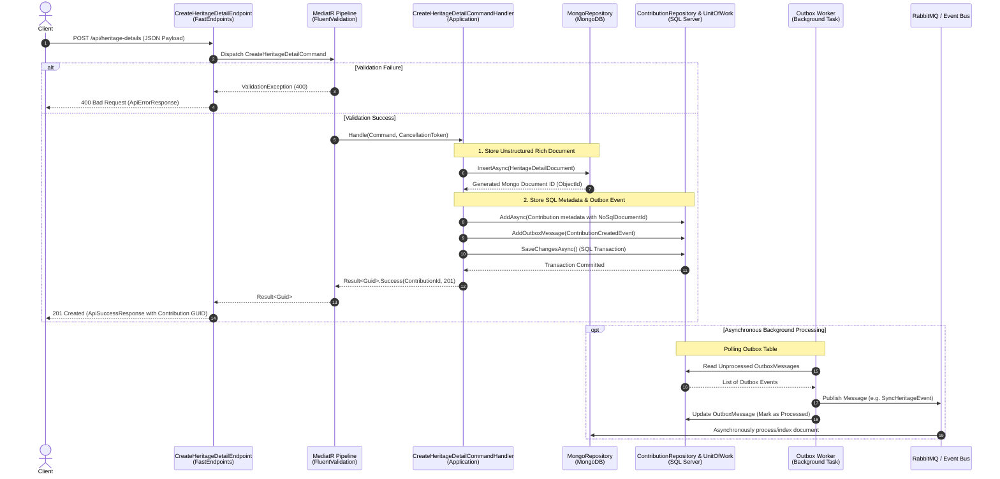

# API Feature Documentation: Create Heritage Detail (`POST /api/heritage-details`)

## 1. Overview


| Property                  | Details                                                                                                                                                                                                                                                     |
| :-------------------------- | :------------------------------------------------------------------------------------------------------------------------------------------------------------------------------------------------------------------------------------------------------------ |
| **Endpoint URL**          | `/api/heritage-details`                                                                                                                                                                                                                                     |
| **HTTP Method**           | `POST`                                                                                                                                                                                                                                                      |
| **Architectural Pattern** | REPR (Request-Endpoint-Response) via FastEndpoints                                                                                                                                                                                                          |
| **Summary**               | Stores rich heritage detail documents (Type 2 Community Articles) in MongoDB and persists transactional metadata into SQL Server.                                                                                                                           |
| **Description**           | Validates incoming payloads via FluentValidation pipeline behaviors, creates an unstructured BSON document in MongoDB, persists SQL metadata via`ContributionRepository` + `UnitOfWork`, and queues transactional outbox messages for async event handling. |

---

## 2. Request Contract (`CreateHeritageDetailCommand`)

### JSON Request Payload Example

```json
{
  "title": "Hoàng Thành Thăng Long - Kiến Trúc Cung Điện Qua Các Thời Kỳ",
  "historicalContext": "Hoàng thành Thăng Long là quần thể di tích gắn liền với lịch sử kinh thành Thăng Long - Hà Nội.",
  "architectureDetails": "Kiến trúc các lớp di chỉ thể hiện qua các thời kỳ Lý, Trần, Lê với hệ thống móng cột và gạch nung hoa văn đặc trưng.",
  "imageUrls": [
    "https://example.com/images/hoang-thanh-1.jpg",
    "https://example.com/images/hoang-thanh-2.jpg"
  ],
  "attributes": {
    "era": "Lý - Trần - Lê",
    "preservationState": "Good"
  },
  "locationId": "a1111111-1111-1111-1111-111111111111",
  "authorId": "b2222222-2222-2222-2222-222222222222"
}
```

### Request Fields Breakdown


| Field Name            | Type                 | Required | Description                                            |
| :---------------------- | :--------------------- | :--------- | :------------------------------------------------------- |
| `title`               | `string`             | **Yes**  | Title of the heritage contribution article.            |
| `historicalContext`   | `string`             | **Yes**  | Detailed historical context narrative.                 |
| `architectureDetails` | `string`             | No       | Architectural description and structural details.      |
| `imageUrls`           | `string[]`           | No       | List of image URLs related to the heritage item.       |
| `attributes`          | `object` (Key-Value) | No       | Custom attributes or key-value metadata.               |
| `locationId`          | `string` (UUID)      | **Yes**  | GUID referencing the target`Location` in SQL Server.   |
| `authorId`            | `string` (UUID)      | **Yes**  | GUID referencing the`User` authoring the contribution. |

---

## 3. Validation Rules (`CreateHeritageDetailValidator`)

Evaluated automatically via FastEndpoints / MediatR Pipeline Behavior using `FluentValidation`:

```csharp
RuleFor(x => x.Title)
    .NotEmpty().WithMessage("Tiêu đề di sản không được để trống");

RuleFor(x => x.HistoricalContext)
    .NotEmpty().WithMessage("Bối cảnh lịch sử không được để trống");

RuleFor(x => x.LocationId)
    .NotEmpty().WithMessage("LocationId không được để trống");

RuleFor(x => x.AuthorId)
    .NotEmpty().WithMessage("AuthorId không được để trống");
```

---

## 4. System Flow Sequence Diagram



---

## 5. Response Contracts

### 5.1. Success Response (`201 Created`)

```json
{
  "message": "SUCCESS_OPERATION",
  "data": "3fa85f64-5717-4562-b3fc-2c963f66afa6"
}
```

### 5.2. Validation / Bad Request Error (`400 Bad Request`)

```json
{
  "message": "Tiêu đề di sản không được để trống",
  "errorCode": "ERR_BAD_REQUEST",
  "errors": [
    {
      "propertyName": "Title",
      "errorMessage": "Tiêu đề di sản không được để trống"
    }
  ],
  "traceId": "0HN123456789A:00000001"
}
```

### 5.3. Resource Not Found Error (`404 Not Found`)

```json
{
  "message": "ERR_DOCUMENT_NOT_FOUND",
  "errorCode": "ERR_INTERNAL_SERVER",
  "errors": null,
  "traceId": "0HN123456789A:00000002"
}
```

### 5.4. Internal Server Error (`500 Internal Server Error`)

```json
{
  "message": "An unexpected database exception occurred.",
  "errorCode": "ERR_INTERNAL_SERVER",
  "errors": null,
  "traceId": "0HN123456789A:00000003"
}
```
