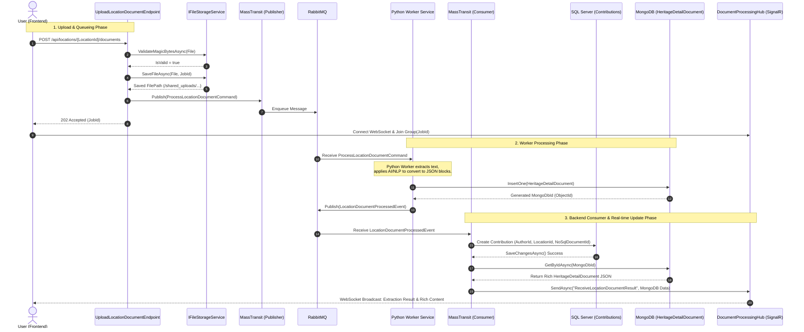

# Location Document Upload & Processing Workflow

This sequence diagram illustrates the complete asynchronous flow when a user uploads a document for a specific location. The process spans across the API, Message Broker (RabbitMQ), Python Worker, SQL Server, MongoDB, and Real-time WebSocket (SignalR).

## End-to-End Sequence Diagram

