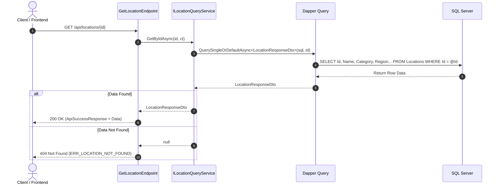
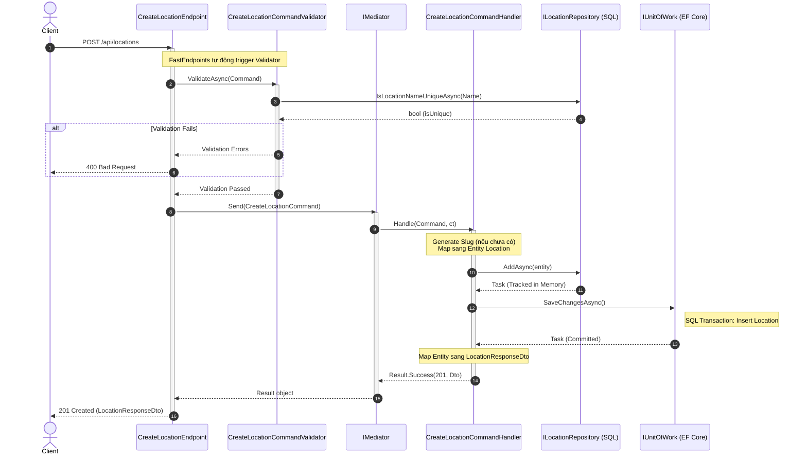
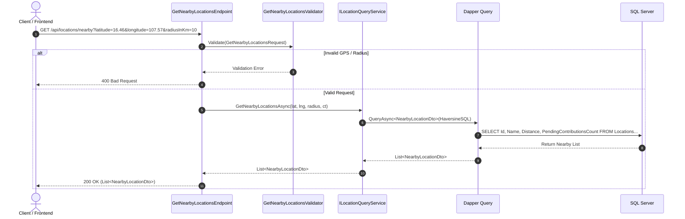
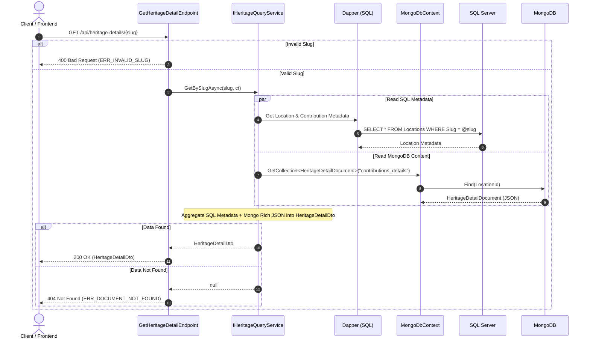
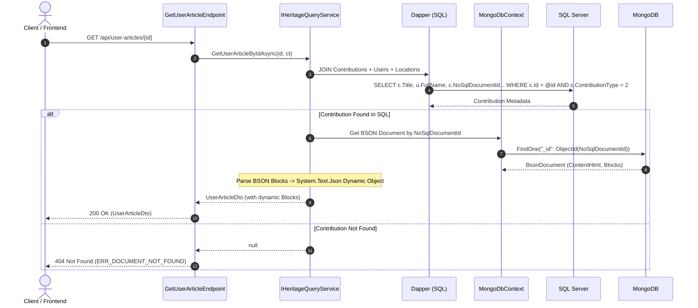
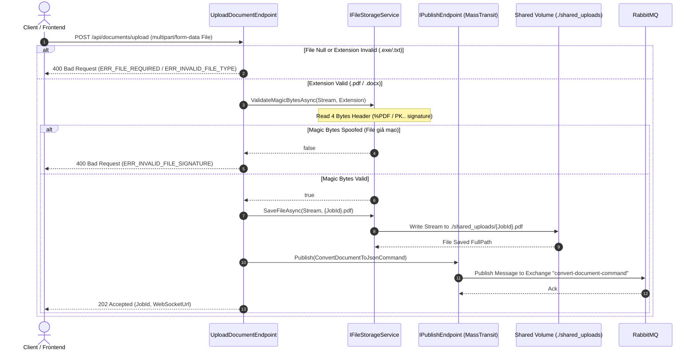
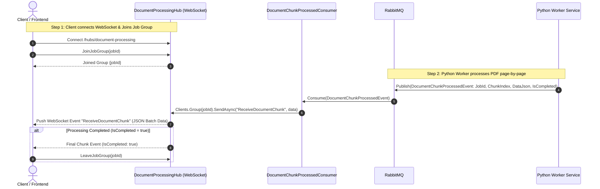
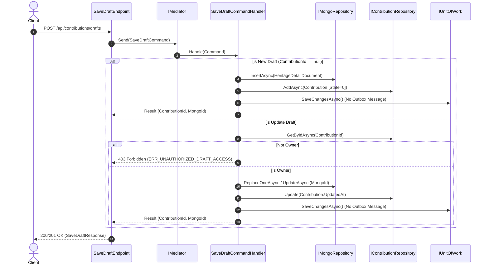
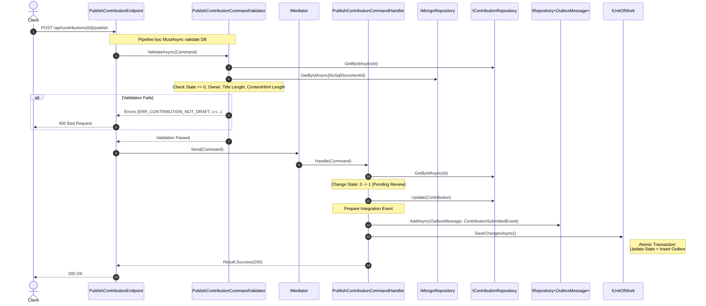

# Sequence Diagrams (Sơ Đồ Tuần Tự) Cho Tất Cả Các Endpoints

Tài liệu này chứa sơ đồ tuần tự (Sequence Diagram) mô tả luồng dữ liệu của tất cả 8 Endpoints và WebSocket Hub trong hệ thống **Viet Heritagepedia Backend** bằng cú pháp **Mermaid.js**.

---

## 1. Group Locations (Quản Lý Địa Điểm)

### 1.1. `GET /api/locations/{id}` - Lấy Chi Tiết Địa Điểm theo ID

---

### 1.2. `POST /api/locations` - Tạo Địa Điểm Mới (CQRS Write)

---

### 1.3. `GET /api/locations/nearby` - Lấy Danh Sách Địa Điểm Lân Cận GPS

---

## 2. Group Heritage Details (Chi Tiết Di Sản Polyglot SQL + Mongo)

### 2.1. `GET /api/heritage-details/{slug}` - Lấy Chi Tiết Di Sản Tổng Hợp

---

### 2.2. `POST /api/heritage-details` (DEPRECATED)

> **[LƯU Ý]** Endpoint này và Command `CreateHeritageDetailCommand` tương ứng đã bị xóa bỏ hoàn toàn trong bộ mã nguồn. 
> Logic lưu trữ Polyglot (SQL + MongoDB) hiện tại đã được chuyển giao cho Cụm Tính Năng Document Editor thông qua luồng **Save Draft** và **Publish Contribution** (Xem mục 5).

---

## 3. Group User Articles (Bài Viết Đóng Góp Từ Người Dùng)

### 3.1. `GET /api/user-articles/{id}` - Lấy Chi Tiết Bài Viết Đóng Góp (Dynamic JSON Blocks)

---

## 4. Group Documents & Real-Time Streaming (Xử Lý Tài Liệu Bất Đồng Bộ)

### 4.1. `POST /api/documents/upload` - Upload Tài Liệu PDF/DOCX (Magic Bytes Check + MassTransit)

---

### 4.2. `SignalR Hub` & `MassTransit Consumer` - Real-Time WebSocket Chunk Streaming

---

## 5. Group Contributions (Document Editor)

### 5.1. `POST /api/contributions/drafts` - Auto-Save Draft (Mỗi lần user thao tác Editor)

---

### 5.2. `POST /api/contributions/{id}/publish` - Publish Bài Viết Từ Draft

